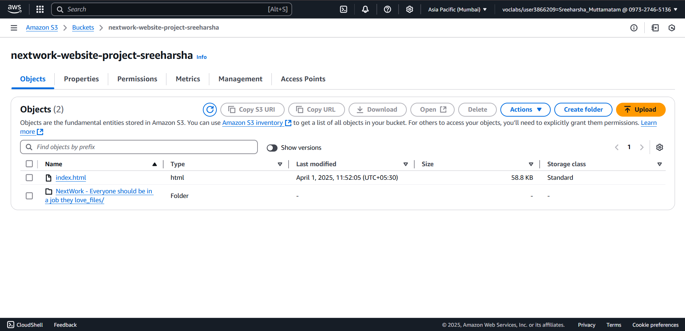

# Hosting a Website on AWS S3

This repository contains files and instructions for hosting a static website using Amazon S3 (Simple Storage Service). The hosted website is a hostel website available at: [Nextwork Hostel Website](http://nextwork-website-project-sreeharsha.s3-website.ap-south-1.amazonaws.com/)

## Table of Contents
- [Prerequisites](#prerequisites)
- [Step-by-Step Guide](#step-by-step-guide)
  - [Step 1: Create an S3 Bucket](#step-1-create-an-s3-bucket)
  - [Step 2: Upload Web Files](#step-2-upload-web-files)
  - [Step 3: Configure Static Website Hosting](#step-3-configure-static-website-hosting)
  - [Step 4: Set Bucket Permissions](#step-4-set-bucket-permissions)
  - [Step 5: Create a Bucket Policy](#step-5-create-a-bucket-policy)
  - [Step 6: Access Your Website](#step-6-access-your-website)
- [Files Included](#files-included)
- [Troubleshooting](#troubleshooting)
- [Resources](#resources)

## Prerequisites
- AWS account
- Basic knowledge of HTML, CSS, JavaScript
- Website files ready to be hosted

## Step-by-Step Guide

### Step 1: Create an S3 Bucket


1. Sign in to the AWS Management Console
2. Navigate to S3 service
3. Click "Create bucket"
4. Enter a unique bucket name (I used "nextwork-website-project-sreeharsha")
5. Select your preferred region (I chose ap-south-1, Mumbai)
6. Keep default settings for now and click "Create bucket"

**Note:** Your bucket name must be globally unique across all AWS accounts.

### Step 2: Upload Web Files



1. Click on your newly created bucket
2. Click "Upload" button
3. Select all your website files (HTML, CSS, JS, images, etc.)
4. Make sure your main page is named `index.html` (this will be your home page)
5. Click "Upload"

**Files to upload:**
- `index.html` (required as the entry point)
- CSS files (usually in a folder called `css` or `styles`)
- JavaScript files (usually in a folder called `js` or `scripts`)
- Image files (usually in a folder called `images` or `img`)
- Any other assets your website uses

### Step 3: Configure Static Website Hosting


1. Select your bucket and go to the "Properties" tab
2. Scroll down to "Static website hosting" and click "Edit"
3. Select "Enable" static website hosting
4. For "Index document," type `index.html`
5. For "Error document," you can optionally specify an error page (e.g., `error.html`)
6. Click "Save changes"

### Step 4: Set Bucket Permissions


1. Go to the "Permissions" tab
2. Under "Block public access," click "Edit"
3. Uncheck "Block all public access" (Note: This makes your bucket content publicly accessible)
4. Click "Save changes" and confirm by typing "confirm"

### Step 5: Create a Bucket Policy


1. Still in the "Permissions" tab, scroll down to "Bucket policy" and click "Edit"
2. Copy and paste the following policy (replace `your-bucket-name` with your actual bucket name):

```json
{
    "Version": "2012-10-17",
    "Id": "MyBucketPolicy",
    "Statement": [
        {
            "Sid": "PublicReadGetObject",
            "Effect": "Allow",
            "Principal": "*",
            "Action": "s3:GetObject",
            "Resource": "arn:aws:s3:::nextwork-website-project-sreeharsha/index.html"
        },
        {
            "Sid": "BucketPutDelete",
            "Effect": "Deny",
            "Principal": "*",
            "Action": "s3:DeleteObject",
            "Resource": "arn:aws:s3:::nextwork-website-project-sreeharsha/index.html"
        }
    ]
}

```

3. Click "Save changes"

This policy allows public read access to all objects in your bucket.

### Step 6: Access Your Website


1. Go back to the "Properties" tab
2. Scroll down to "Static website hosting"
3. Note the "Bucket website endpoint" URL - this is your website's address
4. Click the link or copy and paste it into your browser

Your website is now live at: http://nextwork-website-project-sreeharsha.s3-website.ap-south-1.amazonaws.com/

## Files Included

For a basic hostel website, you should include:

- `index.html` - Main landing page
- `about.html` - About page with information about your hostel
- `rooms.html` - Details about rooms and accommodations
- `facilities.html` - Information about hostel facilities
- `contact.html` - Contact information and form
- `css/style.css` - CSS styling file
- `js/script.js` - JavaScript functionality
- `images/` - Folder containing all website images
  - Include photos of rooms, facilities, common areas, etc.

## Troubleshooting

- **403 Forbidden error**: Check your bucket policy and permissions
- **CSS or images not loading**: Make sure file paths are correct and files are uploaded
- **Website not updating after changes**: Try clearing your browser cache or waiting a few minutes for AWS to propagate changes

## Resources

- [Amazon S3 Documentation](https://docs.aws.amazon.com/s3/)
- [AWS S3 Static Website Hosting](https://docs.aws.amazon.com/AmazonS3/latest/userguide/WebsiteHosting.html)
- [S3 Bucket Policies](https://docs.aws.amazon.com/AmazonS3/latest/userguide/bucket-policies.html)
